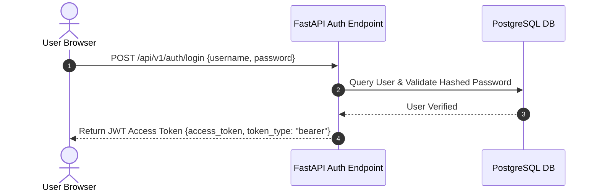
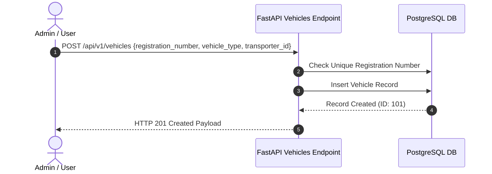
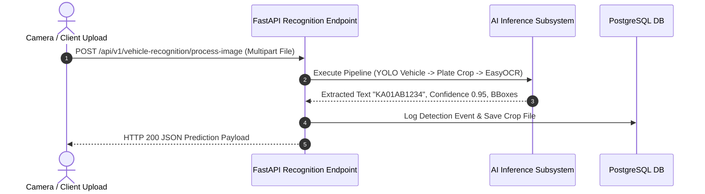
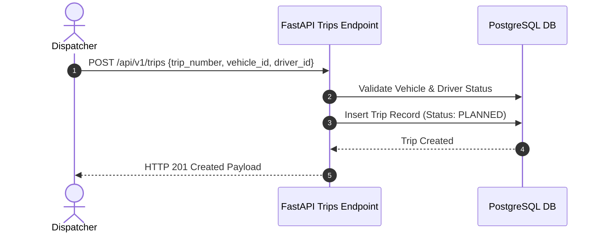
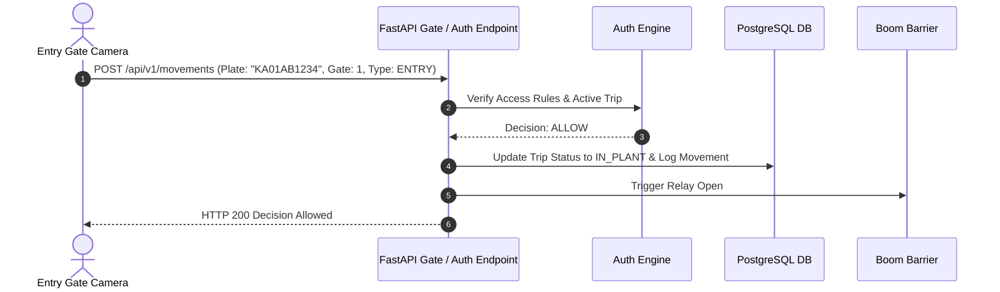
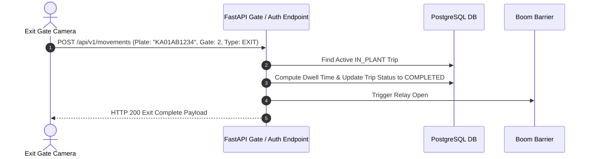
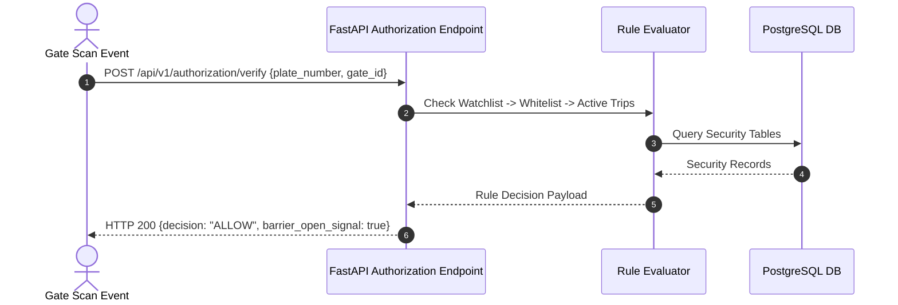

# Industrial Vehicle Trip Management System - REST API Specification

Base URL: `http://localhost:8000/api/v1`

---

## 1. Sequence Diagrams

### 1.1 User Login & Authentication Flow



### 1.2 Vehicle Registration Flow



### 1.3 Vehicle Recognition Flow



### 1.4 Trip Creation Flow



### 1.5 Entry Approval Flow



### 1.6 Exit Approval Flow



### 1.7 Authorization Flow



---

## 2. API Endpoint Specification

### 2.1 Master Data APIs (`/transporters`, `/vehicles`, `/drivers`)

#### `GET /api/v1/transporters`
- **Method**: `GET`
- **Purpose**: Retrieves list of registered logistics transporters.
- **Response `200 OK`**:
```json
[
  {
    "id": 1,
    "code": "TR-1001",
    "name": "Apex Logistics Services",
    "contact_email": "ops@apexlogistics.com",
    "phone": "+91-9876543210",
    "is_active": true
  }
]
```

#### `POST /api/v1/transporters`
- **Method**: `POST`
- **Purpose**: Creates a new transporter.
- **Request Body**:
```json
{
  "code": "TR-1002",
  "name": "Vanguard Freight Carriers",
  "contact_email": "info@vanguard.com",
  "phone": "+91-9123456789",
  "address": "GURGAON, HARYANA",
  "is_active": true
}
```
- **Response `201 Created`**: Returns created object with assigned ID.

---

### 2.2 AI Recognition APIs (`/vehicle-recognition`)

#### `POST /api/v1/vehicle-recognition/process-image`
- **Method**: `POST`
- **Form Data**: `file` (Image binary)
- **Response `200 OK`**:
```json
{
  "processing_time": 0.028,
  "vehicles": [
    {
      "tracking_id": "TEMP-001",
      "vehicle_type": "Heavy Truck",
      "vehicle_confidence": 0.9421,
      "vehicle_bbox": [300, 200, 980, 580],
      "plates": [
        {
          "plate_bbox": [540, 480, 740, 540],
          "confidence": 0.925,
          "plate_text": "KA01AB1234",
          "raw_text": "KA01AB1234",
          "corrected_plate": "KA01AB1234",
          "is_valid_plate": true
        }
      ]
    }
  ],
  "plate_text": "KA01AB1234",
  "confidence": 0.925,
  "is_valid_plate": true,
  "vehicle_count": 1
}
```

---

### 2.3 System & Performance APIs (`/system`, `/benchmark`)

#### `GET /api/v1/system/health`
- **Method**: `GET`
- **Response `200 OK`**:
```json
{
  "status": "healthy",
  "backend": "ONNX",
  "inference_backend": "ONNX (CPU)",
  "tensorrt_available": false,
  "onnx_available": true,
  "pytorch_available": true,
  "cuda_available": false,
  "gpu": "N/A",
  "gpu_enabled": false,
  "model_version": "v11.0-edge-anpr"
}
```

#### `GET /api/v1/system/performance`
- **Method**: `GET`
- **Response `200 OK`**: Returns live CPU %, RAM MB, GPU %, Disk usage, and application uptime.
