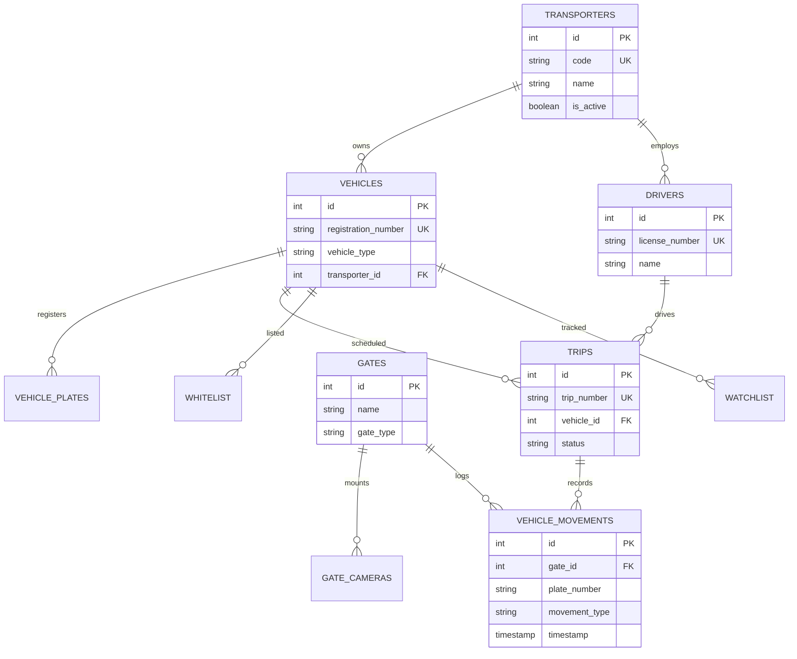
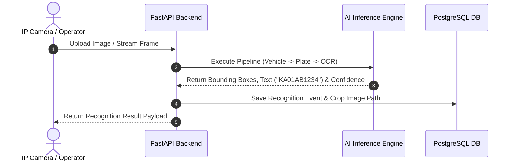
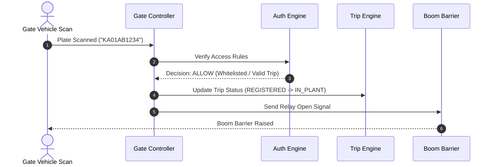
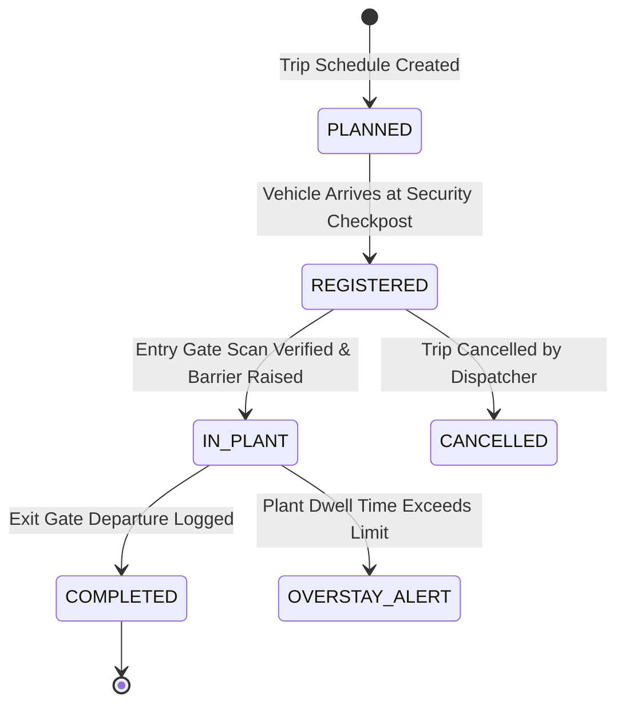
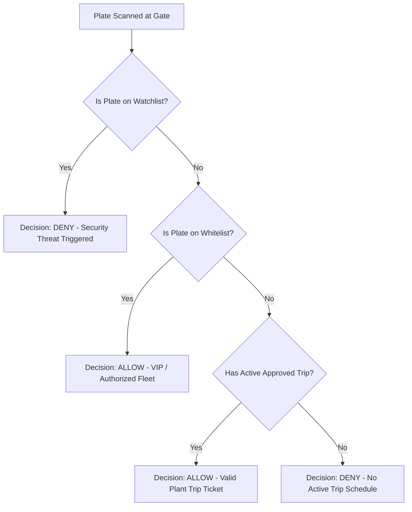
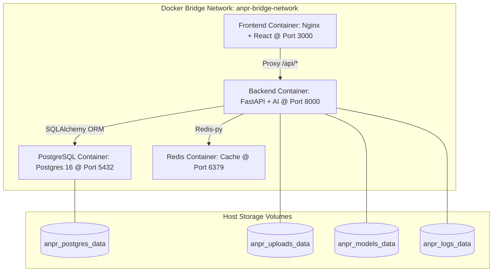

# Industrial Vehicle Trip Management System - System Architecture Specification

This document details the high-level architecture, module breakdowns, and visual diagrams for the complete enterprise platform.

---

## 1. Overall Enterprise Architecture

```mermaid
graph TD
    Client[ReactJS Web Frontend / Gate Kiosk UI] -->|HTTP REST / WebSocket| Nginx[Nginx Reverse Proxy / Load Balancer @ Port 3000]
    Nginx -->|Proxy /api/*| FastAPI[FastAPI Backend Application @ Port 8000]
    
    subgraph Business Service Layer
        FastAPI --> AuthEngine[Authorization & Security Engine]
        FastAPI --> TripEngine[Trip Lifecycle Engine]
        FastAPI --> GateEngine[Entry / Exit Gate Engine]
        FastAPI --> DataPipeline[Data Engineering & Summaries]
    end

    subgraph AI Inference Subsystem
        FastAPI --> BackendSel[Backend Selector: TensorRT -> ONNX -> PyTorch]
        BackendSel --> TRTEngine[NVIDIA TensorRT Engine (FP16)]
        BackendSel --> ONNXEngine[ONNX Runtime Engine]
        BackendSel --> PyTorchEngine[PyTorch YOLOv11 Engine]
        BackendSel --> EasyOCR[Multi-pass EasyOCR Engine]
    end

    subgraph Storage & Persistence Tier
        FastAPI --> Postgres[(PostgreSQL 16 Relational DB)]
        FastAPI --> Redis[(Redis 7 Cache)]
        FastAPI --> Disk[Local Media / Docker Volume]
    end
```

---

## 2. AI Recognition Pipeline Architecture

```mermaid
graph LR
    Input[Frame / RTSP Stream] --> Preproc[Letterbox Resize & Preprocessing]
    Preproc --> VehDet[YOLOv11 Vehicle Detector]
    VehDet --> Tracker[DeepSORT Vehicle Tracker]
    Tracker --> PltDet[YOLOv11 License Plate Detector]
    PltDet --> Crop[Plate Crop Extraction]
    Crop --> Rectify[Homography & Perspective Correction]
    Rectify --> OCR[Multi-pass EasyOCR Ensemble]
    OCR --> RegexVal[Indian Plate Format Validation]
    RegexVal --> Output[JSON ANPR Prediction Payload]
```



---

## 3. Database Entity Relationship (ER) Diagram



---

## 4. Recognition Workflow Diagram



---

## 5. Entry / Exit Workflow Diagram



---

## 6. Trip Engine Workflow Diagram



---

## 7. Authorization Workflow Diagram



---

## 8. Docker Deployment Architecture Diagram


