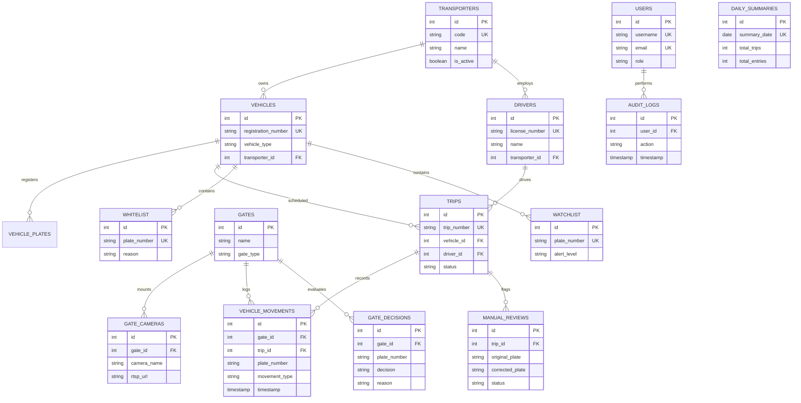

# Industrial Vehicle Trip Management System - Database Schema Specification

Database Engine: **PostgreSQL 16**  
Database Name: `anpr_db`

---

## 1. Database Entity Relationship (ER) Diagram

---

## 2. Comprehensive Table Specifications

### 2.1 `transporters`
Stores logistics vendors, transport partners, and fleet operators.
- **Primary Key**: `id` (SERIAL)
- **Unique Constraints**: `code` (VARCHAR(50))
- **Columns**: `id`, `code`, `name`, `contact_email`, `phone`, `address`, `is_active`, `created_at`, `updated_at`
- **Relationships**: Referenced by `vehicles.transporter_id`, `drivers.transporter_id`.
- **Indexes**: `ix_transporters_code` (Unique), `ix_transporters_name`.

### 2.2 `vehicles`
Stores registered plant vehicles and fleet trucks.
- **Primary Key**: `id` (SERIAL)
- **Unique Constraints**: `registration_number` (VARCHAR(50))
- **Foreign Keys**: `transporter_id` -> `transporters.id`
- **Columns**: `id`, `registration_number`, `vehicle_type`, `transporter_id`, `chassis_number`, `is_active`, `created_at`
- **Relationships**: Belongs to `transporters`; referenced by `vehicle_plates`, `trips`.
- **Indexes**: `ix_vehicles_registration_number` (Unique), `ix_vehicles_transporter_id`.

### 2.3 `vehicle_plates`
Stores license plate metadata, color classifications, and verification status.
- **Primary Key**: `id` (SERIAL)
- **Foreign Keys**: `vehicle_id` -> `vehicles.id`
- **Columns**: `id`, `plate_number`, `plate_type` (`COMMERCIAL`, `STANDARD`, `PERMIT`), `vehicle_id`, `state_code`, `is_verified`
- **Relationships**: Belongs to `vehicles`.

### 2.4 `drivers`
Stores commercial truck driver records and license details.
- **Primary Key**: `id` (SERIAL)
- **Unique Constraints**: `license_number` (VARCHAR(50))
- **Foreign Keys**: `transporter_id` -> `transporters.id`
- **Columns**: `id`, `name`, `license_number`, `phone`, `transporter_id`, `is_active`
- **Relationships**: Belongs to `transporters`; referenced by `trips`.

### 2.5 `gates`
Defines industrial plant gates.
- **Primary Key**: `id` (SERIAL)
- **Columns**: `id`, `name`, `gate_type` (`ENTRY`, `EXIT`, `BIDIRECTIONAL`), `location`, `is_active`
- **Relationships**: Referenced by `gate_cameras`, `vehicle_movements`, `gate_decisions`.

### 2.6 `gate_cameras`
Stores IP RTSP camera assignments for each gate.
- **Primary Key**: `id` (SERIAL)
- **Foreign Keys**: `gate_id` -> `gates.id`
- **Columns**: `id`, `camera_name`, `rtsp_url`, `gate_id`, `direction` (`ENTRY`, `EXIT`), `is_active`
- **Relationships**: Belongs to `gates`.

### 2.7 `trips`
Orchestrates the lifecycle of plant logistics trips.
- **Primary Key**: `id` (SERIAL)
- **Unique Constraints**: `trip_number` (VARCHAR(100))
- **Foreign Keys**: `vehicle_id` -> `vehicles.id`, `driver_id` -> `drivers.id`
- **Columns**: `id`, `trip_number`, `vehicle_id`, `driver_id`, `status` (`PLANNED`, `REGISTERED`, `IN_PLANT`, `COMPLETED`, `CANCELLED`), `entry_time`, `exit_time`, `dwell_time_minutes`
- **Relationships**: Referenced by `vehicle_movements`, `manual_reviews`.
- **Indexes**: `ix_trips_trip_number` (Unique), `ix_trips_status`, `ix_trips_entry_time`.

### 2.8 `vehicle_movements`
Logs real-time gate entry and exit passage events.
- **Primary Key**: `id` (SERIAL)
- **Foreign Keys**: `gate_id` -> `gates.id`, `trip_id` -> `trips.id`
- **Columns**: `id`, `gate_id`, `trip_id`, `plate_number`, `movement_type` (`ENTRY`, `EXIT`), `confidence`, `crop_path`, `timestamp`
- **Indexes**: `ix_movements_plate_number`, `ix_movements_timestamp`.

### 2.9 `vehicle_detections` & `ocr_results`
Stores raw AI detection bounding boxes and OCR confidence text outputs.
- **Primary Key**: `id` (SERIAL)
- **Columns**: `tracking_id`, `vehicle_type`, `vehicle_confidence`, `plate_text`, `ocr_confidence`, `timestamp`

### 2.10 `manual_reviews` & `ocr_feedback_dataset`
Human-in-the-loop review queue for low-confidence OCR corrections.
- **Primary Key**: `id` (SERIAL)
- **Foreign Keys**: `trip_id` -> `trips.id`
- **Columns**: `id`, `trip_id`, `original_plate`, `corrected_plate`, `status` (`PENDING`, `REVIEWED`, `REJECTED`), `reviewed_by`, `reviewed_at`

### 2.11 `whitelist_entries` & `watchlist_entries`
Security access control lists.
- **Primary Key**: `id` (SERIAL)
- **Unique Constraints**: `plate_number` (VARCHAR(50))
- **Columns**: `id`, `plate_number`, `reason`, `alert_level` (`LOW`, `MEDIUM`, `HIGH`, `CRITICAL`), `is_active`

### 2.12 `gate_decisions`
Logs automated gate access decisions.
- **Primary Key**: `id` (SERIAL)
- **Foreign Keys**: `gate_id` -> `gates.id`
- **Columns**: `id`, `gate_id`, `plate_number`, `decision` (`ALLOW`, `DENY`), `reason`, `timestamp`

### 2.13 `daily_summaries` & `daily_gate_summaries`
Aggregated metrics for daily plant reporting.
- **Primary Key**: `id` (SERIAL)
- **Unique Constraints**: `summary_date` (DATE)
- **Columns**: `id`, `summary_date`, `total_trips`, `total_entries`, `total_exits`, `avg_dwell_time_minutes`

### 2.14 `users`, `roles`, & `audit_logs`
System authentication, RBAC authorization, and security audit trail.
- **Primary Key**: `id` (SERIAL)
- **Columns**: `id`, `username`, `email`, `hashed_password`, `role` (`ADMIN`, `DISPATCHER`, `SECURITY_GUARD`, `VIEWER`), `is_active`
- **Audit Log Columns**: `id`, `user_id`, `action`, `resource`, `details`, `timestamp`
