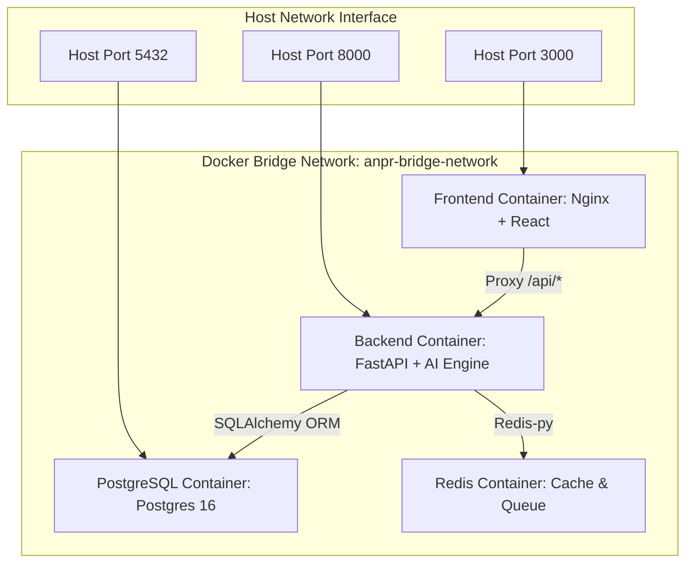
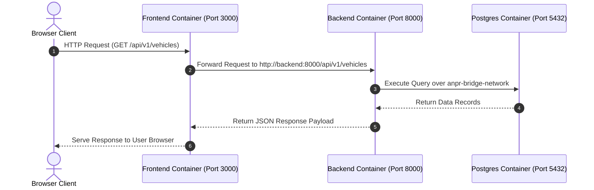

# Multi-Container Docker Production Deployment Guide

This document details the multi-container Docker architecture, network configuration, storage volumes, container lifecycles, and Compose workflows.

---

## 1. Docker Architecture & Container Communication Diagrams

### 1.1 Docker Multi-Container Architecture



### 1.2 Container Communication Workflow



---

## 2. Container Overview Matrix

| Service Name | Base Image | Port Mapping | Health Check | Description |
| :--- | :--- | :--- | :--- | :--- |
| **`frontend`** | `nginx:alpine` (Multi-stage Node 20) | `3000:3000` | HTTP GET `/` | Production Nginx server serving built React SPA & reverse proxying `/api/`. |
| **`backend`** | `python:3.11-slim` | `8000:8000` | HTTP GET `/health` | FastAPI REST API, AI inference engine, and database repositories. |
| **`postgres`** | `postgres:16-alpine` | `5432:5432` | `pg_isready -U postgres` | Relational database persisting trip records, vehicles, and audit trails. |
| **`redis`** | `redis:7-alpine` | `6379:6379` | `redis-cli ping` | In-memory cache and background message queue. |

---

## 3. Persistent Docker Volumes

| Volume Name | Container Target Path | Purpose |
| :--- | :--- | :--- |
| `anpr_postgres_data` | `/var/lib/postgresql/data` | Database tables & records |
| `anpr_redis_data` | `/data` | Redis cache persistence |
| `anpr_uploads_data` | `/app/backend/uploads` | Uploaded images & video crops |
| `anpr_models_data` | `/app/models` | Exported ONNX / TensorRT models |
| `anpr_logs_data` | `/app/logs` | Diagnostic & application logs |

---

## 4. Single-Command Launch & Workflows

### Standard Launch
```bash
docker compose up --build
```

### Production Launch (Background Daemon with Restart Policies)
```bash
docker compose -f docker-compose.yml -f docker-compose.prod.yml up -d --build
```

### Inspect Container Status & Health
```bash
docker compose ps
```

### View Live Container Logs
```bash
docker compose logs -f backend
```

### Stopping Containers
```bash
docker compose down
```
To remove volumes as well: `docker compose down -v`.
