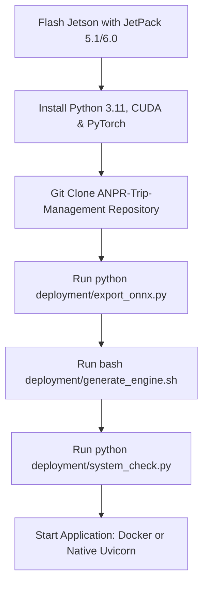

# NVIDIA Jetson Production Deployment Runbook

This document details the complete deployment process for running the Industrial Vehicle Trip Management System on NVIDIA Jetson Edge devices.

---

## 1. Overview & Supported Edge Hardware Matrix

The system is optimized for NVIDIA Jetson ARM64 SoC platforms, leveraging CUDA, cuDNN, and TensorRT for low-latency (< 30ms) edge AI inference.

| Jetson Hardware Model | Architecture | CUDA Cores | Tensor Cores | Recommended Batch / Precision |
| :--- | :--- | :--- | :--- | :--- |
| **NVIDIA Jetson Nano** | Maxwell (4GB) | 128 | 0 | Batch 1 (FP32 / ONNX Fallback) |
| **NVIDIA Jetson Xavier NX** | Volta (8GB/16GB) | 384 | 48 | Batch 1-2 (FP16 TensorRT) |
| **NVIDIA Jetson AGX Xavier** | Volta (16GB/32GB)| 512 | 64 | Batch 1-4 (FP16 TensorRT) |
| **NVIDIA Jetson Orin Nano** | Ampere (4GB/8GB) | 512/1024 | 16/32 | Batch 1-2 (FP16 TensorRT) |
| **NVIDIA Jetson Orin NX** | Ampere (8GB/16GB)| 1024/1792| 32/56 | Batch 1-4 (FP16 TensorRT) |
| **NVIDIA Jetson AGX Orin** | Ampere (32GB/64GB)| 1792/2048| 56/64 | Batch 1-8 (FP16 / INT8 TensorRT) |

---

## 2. Software Requirements & JetPack Matrix

Ensure your target Jetson board is flashed with a compatible JetPack OS version:

- **OS / Linux Version**: Ubuntu 20.04 LTS (L4T 35.4.1) or Ubuntu 22.04 LTS (L4T 36.3.0)
- **JetPack Version**: JetPack 5.1.2+ or JetPack 6.0+
- **CUDA Toolkit**: CUDA 11.8+ or CUDA 12.2+
- **cuDNN**: cuDNN 8.6+ or 8.9+
- **TensorRT**: TensorRT 8.5.2+ or 8.6.1+
- **Python**: Python 3.8, 3.10, or 3.11
- **Node.js**: Node.js 18.x or 20.x LTS
- **PostgreSQL**: PostgreSQL 16.x (or via Docker)

---

## 3. Jetson Deployment Pipeline Diagram



---

## 4. Step-by-Step Project Deployment

### Step 1: Clone Repository
```bash
git clone https://github.com/your-org/ANPR-Trip-Management.git
cd ANPR-Trip-Management
```

### Step 2: Virtual Environment Setup & Backend Installation
```bash
python3 -m venv venv
source venv/bin/activate

pip install --upgrade pip setuptools wheel
pip install -r backend/requirements.txt
```

### Step 3: Database Setup & Migrations
```bash
cd backend
python create_tables.py
alembic upgrade head
cd ..
```

### Step 4: Configure Environment Variables (`.env`)
```bash
cp .env.example .env
```
Ensure `.env` contains:
```env
MODEL_BACKEND=AUTO
GPU_ENABLED=true
GPU_DEVICE=0
TENSORRT_ENGINE_PATH=models/
```

### Step 5: Export ONNX Models & Build Native TensorRT Engines
```bash
# 1. Export ONNX Models
python deployment/export_onnx.py

# 2. Compile native FP16 TensorRT Engines on Jetson GPU
bash deployment/generate_engine.sh
```

### Step 6: Verify System Hardware & Inference Pipeline
```bash
python deployment/system_check.py
```

---

## 5. Running the Application on Jetson

### Option A: Running with Docker (Recommended)
```bash
docker compose up --build -d
```

### Option B: Running Natively
```bash
# Terminal 1: Backend
cd backend
uvicorn app.main:app --host 0.0.0.0 --port 8000 --workers 2

# Terminal 2: Frontend
cd frontend
npm run dev
```

---

## 6. Testing & Validation

### Health Check Verification
```bash
curl http://localhost:8000/api/system/health
```
Expected output shows `"backend": "TENSORRT"`, `"cuda_available": true`.

### Testing Camera Ingestion & Image Recognition
```bash
# Run benchmark on synthetic frames or test image
python -m app.benchmark.benchmark_runner
```

---

## 7. Jetson Performance Optimization Recommendations

1. **Enable Max Performance Power Mode**:
   ```bash
   sudo nvpmodel -m 0
   sudo jetson_clocks
   ```
2. **Use FP16 Precision**: TensorRT FP16 yields a ~4x latency speedup over FP32 with negligible accuracy change.
3. **Offload RTSP Decoding**: Use GStreamer hardware H.264/H.265 decoders (`nvv4l2decoder`) for video streams.
