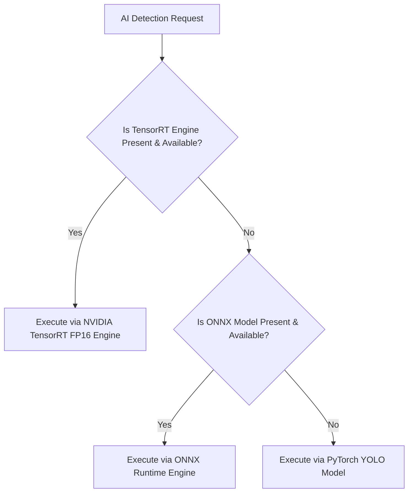

# ONNX & NVIDIA TensorRT Inference Optimization Guide

This document details the conversion pipeline from PyTorch models to ONNX format, compilation of native TensorRT engines, precision mode selection, and automated fallback handling.

---

## 1. Inference Backend Selection & Fallback Order

The system uses `BackendSelector` (`backend/app/ai/inference/backend_selector.py`) to resolve inference execution backends:



### Priority Order:
1. **TensorRT (`.engine`)**: Highest performance (< 5ms latency, FP16 GPU accelerated).
2. **ONNX Runtime (`.onnx`)**: Intermediate performance (~14ms CUDA / ~29ms CPU).
3. **PyTorch (`.pt`)**: Baseline fallback (~49ms CPU).

---

## 2. Exporting PyTorch Models to ONNX

The export script `deployment/export_onnx.py`:
- Converts PyTorch YOLO model weights (`backend/yolo11n.pt`) to ONNX format.
- Uses `opset=12`, `imgsz=640`, `dynamic=False` for maximum ONNX Runtime & TensorRT compatibility.
- Saves output models to `models/vehicle_detector.onnx` and `models/plate_detector.onnx`.

Command:
```bash
python deployment/export_onnx.py
```

Verification Command:
```bash
python deployment/verify_onnx.py
```

---

## 3. NVIDIA TensorRT Compilation (`trtexec`)

### Cross-Compilation Restrictions
> [!WARNING]
> TensorRT `.engine` files generated on Windows x86 GPUs will **NOT** deserialize on Linux ARM64 Jetson devices due to CUDA architecture and driver differences. TensorRT engines must be compiled natively on target Jetson hardware.

### Native Jetson Compilation Commands
On target Jetson device:

```bash
# Vehicle Detector Engine Compilation (FP16 Precision)
trtexec --onnx=models/vehicle_detector.onnx \
        --saveEngine=models/vehicle_detector.engine \
        --fp16 \
        --workspace=2048

# License Plate Detector Engine Compilation (FP16 Precision)
trtexec --onnx=models/plate_detector.onnx \
        --saveEngine=models/plate_detector.engine \
        --fp16 \
        --workspace=2048
```

---

## 4. Expected Directory Structure

```
ANPR-Trip-Management/
├── backend/
│   └── yolo11n.pt                # Base PyTorch weights
├── models/
│   ├── vehicle_detector.onnx    # Exported ONNX vehicle model (10.2 MB)
│   ├── plate_detector.onnx      # Exported ONNX plate model (10.2 MB)
│   ├── vehicle_detector.engine  # Native Jetson TensorRT engine
│   └── plate_detector.engine    # Native Jetson TensorRT engine
└── deployment/
    ├── export_onnx.py            # PyTorch -> ONNX exporter
    ├── verify_onnx.py            # ONNX graph checker
    └── generate_engine.sh        # Jetson trtexec compilation script
```
