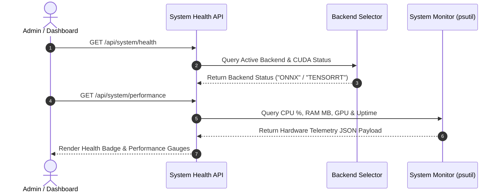

# System Health & Performance Monitoring Specification

This document details the health diagnostics architecture, real-time performance telemetry endpoints, and metrics interpretation.

---

## 1. Health Monitoring Workflow Diagram



---

## 2. Health & Performance API Endpoints

### 2.1 `GET /api/system/health`
- **Purpose**: Returns active inference backend status, CUDA availability, GPU device info, and model version.
- **Response Schema**:
```json
{
  "status": "healthy",
  "backend": "ONNX",
  "inference_backend": "ONNX (CPU)",
  "tensorrt_available": false,
  "onnx_available": true,
  "pytorch_available": true,
  "cuda_available": false,
  "gpu": "N/A",
  "gpu_enabled": false,
  "model_version": "v11.0-edge-anpr"
}
```

### 2.2 `GET /api/system/performance`
- **Purpose**: Returns live real-time hardware telemetry (CPU %, RAM MB, GPU %, Disk usage, application uptime).
- **Response Schema**:
```json
{
  "cpu": {
    "usage_percent": 24.5,
    "core_count": 8,
    "temperature_celsius": 44.0
  },
  "ram": {
    "used_mb": 1250.0,
    "total_mb": 16384.0,
    "usage_percent": 32.1,
    "process_memory_mb": 420.5
  },
  "gpu": {
    "gpu_available": false,
    "gpu_name": "N/A",
    "gpu_usage_percent": 0.0,
    "gpu_memory_used_mb": 0.0
  },
  "disk": {
    "used_gb": 45.2,
    "total_gb": 512.0,
    "usage_percent": 8.8
  },
  "runtime": {
    "active_backend": "ONNX",
    "application_uptime_sec": 3600.0
  }
}
```

### 2.3 `GET /api/system/benchmark`
- **Purpose**: Returns latest benchmark throughput, latency breakdown, accuracy scores, and health classification.

### 2.4 `GET /api/system/benchmark/history`
- **Purpose**: Returns historical benchmark execution logs.

---

## 3. Health Classification Thresholds

The system classifies health status dynamically:
- **`Excellent`**: Complete pipeline latency < 35ms or Throughput ≥ 30 FPS.
- **`Good`**: Complete pipeline latency < 70ms or Throughput ≥ 15 FPS.
- **`Average`**: Complete pipeline latency < 120ms or Throughput ≥ 8 FPS.
- **`Needs Optimization`**: Complete pipeline latency ≥ 120ms.
